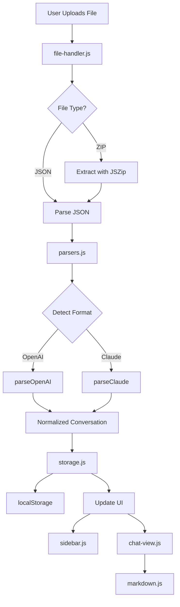

# Architecture

LLM Conversations Viewer is built as a client-side single-page application using vanilla JavaScript with ES6 modules. No build tools or frameworks are required.

## Core Components

### Application Entry Point

**`js/app.js`**

Main application controller that:

- Initializes all components on page load
- Manages application state
- Coordinates between UI components and data layer
- Handles conversation selection and display

### Data Processing

**`js/parsers.js`**

Format detection and conversation parsing:

- `detectFormat(data)` - Identifies OpenAI vs Claude format
- `parseOpenAI(data)` - Parses OpenAI conversation trees
- `parseClaude(data)` - Parses Claude conversation arrays
- Normalizes both formats to common structure

**`js/utils/storage.js`**

Browser localStorage persistence:

- `saveConversation(conversation)` - Stores a conversation
- `loadConversations()` - Retrieves all stored conversations
- `deleteConversation(id)` - Removes a conversation
- `clearAll()` - Clears all data

### File Handling

**`js/utils/file-handler.js`**

Manages file uploads and drag-drop:

- Handles `.json` and `.zip` file types
- Extracts conversations from ZIP archives using JSZip
- Validates file contents
- Triggers parsing and storage

### UI Components

**`js/ui/sidebar.js`**

Conversation list sidebar:

- Renders conversation titles with metadata
- Handles conversation selection
- Provides delete functionality
- Updates when new conversations are added

**`js/ui/chat-view.js`**

Main conversation display:

- Renders message list
- Applies role-based styling (user/assistant/system)
- Integrates markdown rendering
- Displays message metadata (timestamps, models)

**`js/ui/markdown.js`**

Markdown processing:

- Uses Marked.js for parsing markdown
- Integrates highlight.js for code syntax highlighting
- Sanitizes output to prevent XSS
- Configures custom rendering options

## Data Flow



## State Management

Application state is managed through a combination of:

1. **localStorage** - Persistent conversation data
2. **DOM State** - Current conversation selection
3. **Module State** - Component-level state in each module

No global state management library is used - state is kept minimal and local to components.

## Event Flow

### File Upload Flow

1. User selects file or drops file on page
2. `file-handler.js` reads file content
3. If ZIP, extracts `conversations.json`
4. JSON parsed and passed to `parsers.js`
5. Format detected and appropriate parser called
6. Normalized conversation(s) returned
7. Each conversation saved to localStorage
8. Sidebar updated with new conversations

### Conversation View Flow

1. User clicks conversation in sidebar
2. Sidebar emits selection event
3. App loads conversation from localStorage
4. Chat view renders message list
5. Each message processed through markdown renderer
6. Code blocks highlighted by highlight.js
7. Final HTML inserted into DOM

## Module System

The app uses ES6 modules for code organization:

```javascript
// Main app imports all dependencies
import { parseFile } from './parsers.js';
import { renderSidebar } from './ui/sidebar.js';
import { renderChat } from './ui/chat-view.js';
```

Benefits:

- Clear dependency graph
- Code splitting by feature
- No global namespace pollution
- Tree-shaking ready (though not currently used)

## External Dependencies

### Bootstrap 5.3

Provides:

- Responsive grid layout
- UI components (buttons, cards, etc.)
- Utility classes
- Dark/light mode support

### Marked.js

Markdown parser that converts markdown text to HTML.

### Highlight.js

Syntax highlighting for code blocks in multiple languages.

### JSZip

Extracts files from ZIP archives in the browser.

## Browser Compatibility

Requires modern browser with:

- ES6 module support
- localStorage API
- File API for file reading
- Promise support

Tested on:

- Chrome 90+
- Firefox 88+
- Safari 14+
- Edge 90+

## Security Considerations

### XSS Prevention

- Markdown content is sanitized before rendering
- No direct `innerHTML` assignment of user content
- Code highlighting escapes HTML entities

### Data Privacy

- All processing happens client-side
- No network requests to external servers
- Data stored only in browser localStorage
- No analytics or tracking

### File Validation

- File type validation before processing
- JSON structure validation
- Error handling for corrupted files
- Size limits respected by browser APIs

## Performance

### Optimization Strategies

- Lazy rendering of large conversations
- Event delegation for dynamic content
- Minimal DOM manipulation
- localStorage for instant load on revisit

### Limitations

- localStorage typically limited to 5-10MB
- Very large conversations may impact performance
- Browser memory limits for file processing

## Future Considerations

Potential improvements:

- IndexedDB for larger storage capacity
- Virtual scrolling for huge conversations
- Service worker for offline support
- Export functionality
- Search within conversations
- Conversation merge/split tools
