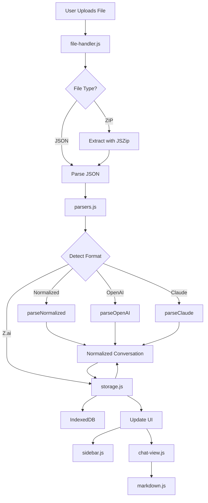
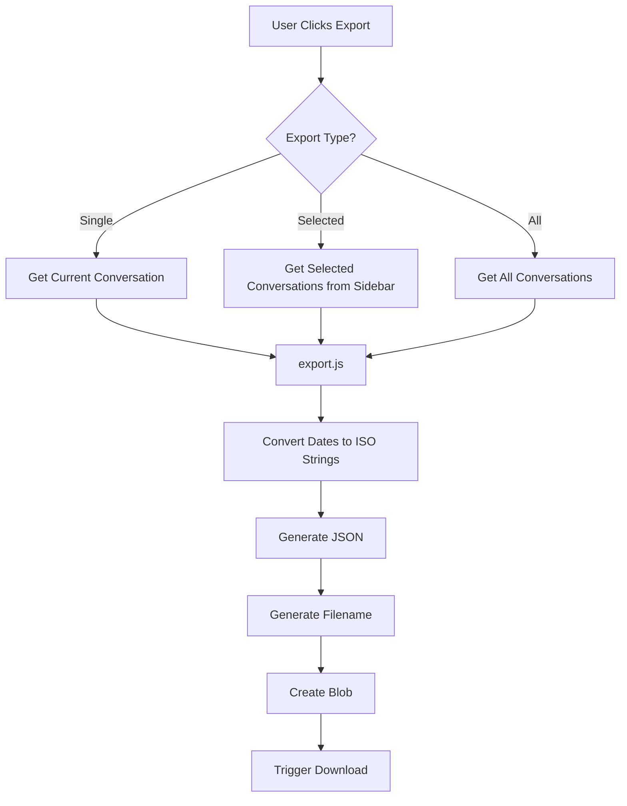

# Architecture

LLM Conversations Viewer is built as a client-side single-page application using vanilla JavaScript with ES6 modules. No build tools or frameworks are required.

## Core Components

### Application Entry Point

**`js/app.js`**

Main application controller that:

- Initializes all components on page load
- Manages application state
- Coordinates between UI components and data layer
- Handles conversation selection and display

### Data Processing

**`js/parsers.js`**

Format detection and conversation parsing:

- `detectFormat(data)` - Identifies format (normalized, OpenAI, Claude, or Z.ai)
- `parseOpenAI(data)` - Parses OpenAI conversation trees
- `parseClaude(data)` - Parses Claude conversation arrays
- `parseZai(data)` - Parses Z.ai conversation trees
- `parseNormalized(data)` - Parses previously exported conversations
- Normalizes all formats to common internal structure

**`js/utils/storage.js`**

Storage persistence wrapper using IndexedDB:

- `saveConversations(conversations)` - Stores conversations (async)
- `loadConversations()` - Retrieves all stored conversations (async)
- `clearConversations()` - Clears all data (async)
- `getStorageSize()` - Returns storage size in bytes (async)
- `isAvailable()` - Checks if IndexedDB is available

**`js/utils/indexeddb.js`**

IndexedDB implementation providing large storage capacity (100MB+):

- `init()` - Initializes database connection
- `saveConversations(conversations)` - Stores all conversations
- `loadConversations()` - Retrieves all conversations with date parsing
- `clearConversations()` - Clears all stored data
- Automatic migration from localStorage on first load

**`js/utils/export.js`**

Conversation export functionality:

- `exportConversations(conversations, filename)` - Exports one or more conversations as JSON
- `generateFilename(conversations)` - Generates appropriate filename based on conversation metadata
- Converts Date objects to ISO 8601 strings for JSON serialization
- Creates downloadable blob and triggers browser download

### File Handling

**`js/utils/file-handler.js`**

Manages file uploads and drag-drop:

- Handles `.json` and `.zip` file types
- Extracts conversations from ZIP archives using JSZip
- Validates file contents
- Triggers parsing and storage

### UI Components

**`js/ui/sidebar.js`**

Conversation list sidebar:

- Renders conversation titles with metadata and checkboxes
- Handles conversation selection (for viewing)
- Manages multi-select state for export
- Provides select all/none controls
- Updates when new conversations are added

**`js/ui/chat-view.js`**

Main conversation display:

- Renders message list
- Applies role-based styling (user/assistant/system)
- Integrates markdown rendering
- Displays message metadata (timestamps, models)

**`js/ui/markdown.js`**

Markdown processing:

- Uses Marked.js for parsing markdown
- Integrates highlight.js for code syntax highlighting
- Sanitizes output to prevent XSS
- Configures custom rendering options

## Data Flow

### Import Flow



### Export Flow



## State Management

Application state is managed through a combination of:

1. **IndexedDB** - Persistent conversation data with large storage capacity
2. **DOM State** - Current conversation selection
3. **Module State** - Component-level state in each module

No global state management library is used - state is kept minimal and local to components.

## Event Flow

### File Upload Flow

1. User selects file or drops file on page
2. `file-handler.js` reads file content
3. If ZIP, extracts `conversations.json`
4. JSON parsed and passed to `parsers.js`
5. Format detected and appropriate parser called
6. Normalized conversation(s) returned
7. Each conversation saved to IndexedDB
8. Sidebar updated with new conversations

### Conversation View Flow

1. User clicks conversation in sidebar
2. Sidebar emits selection event
3. App loads conversation from IndexedDB
4. Chat view renders message list
5. Each message processed through markdown renderer
6. Code blocks highlighted by highlight.js
7. Final HTML inserted into DOM

## Module System

The app uses ES6 modules for code organization:

```javascript
// Main app imports all dependencies
import { parseFile } from './parsers.js';
import { renderSidebar } from './ui/sidebar.js';
import { renderChat } from './ui/chat-view.js';
```

Benefits:

- Clear dependency graph
- Code splitting by feature
- No global namespace pollution
- Tree-shaking ready (though not currently used)

## External Dependencies

### Bootstrap 5.3

Provides:

- Responsive grid layout
- UI components (buttons, cards, etc.)
- Utility classes
- Dark/light mode support

### Marked.js

Markdown parser that converts markdown text to HTML.

### Highlight.js

Syntax highlighting for code blocks in multiple languages.

### JSZip

Extracts files from ZIP archives in the browser.

## Browser Compatibility

Requires modern browser with:

- ES6 module support
- IndexedDB API
- File API for file reading
- Promise support

Tested on:

- Chrome 90+
- Firefox 88+
- Safari 14+
- Edge 90+

## Security Considerations

### XSS Prevention

- Markdown content is sanitized before rendering
- No direct `innerHTML` assignment of user content
- Code highlighting escapes HTML entities

### Data Privacy

- All processing happens client-side
- No network requests to external servers
- Data stored only in browser IndexedDB
- No analytics or tracking

### File Validation

- File type validation before processing
- JSON structure validation
- Error handling for corrupted files
- Size limits respected by browser APIs

## Performance

### Optimization Strategies

- Lazy rendering of large conversations
- Event delegation for dynamic content
- Minimal DOM manipulation
- IndexedDB for instant load on revisit

### Limitations

- IndexedDB provides 100MB+ storage capacity (vs 5-10MB for localStorage)
- Very large conversations may impact performance
- Browser memory limits for file processing

## Export Feature

### User Interface

**Single Conversation Export:**
- Button in chat header (visible when conversation is selected)
- Downloads conversation with sanitized filename based on title
- Example: `getting-x-header-values-in-javascript.json`

**Selected Conversations Export:**
- Checkboxes appear next to each conversation in the sidebar
- Blue export button appears when one or more conversations are selected
- "All" and "None" buttons for quick selection management
- Downloads selected conversations with timestamp-based filename
- Selection persists while searching/filtering
- Example: `conversations-2024-01-15T10-30-00.json`

**Bulk Export:**
- Green button in sidebar header (visible when conversations exist)
- Downloads all conversations with timestamp-based filename
- Example: `conversations-2024-01-15T10-30-00.json`

### Export Format

Exported files use the normalized format with:
- ISO 8601 timestamps (serialized from Date objects)
- All original metadata preserved
- Original format indicator (`openai`, `claude`, or `zai`)
- Can be directly re-imported without data loss

### Implementation Details

1. **Filename Generation:**
   - Single conversation: sanitizes title, removes special characters, limits to 50 chars
   - Multiple conversations (selected or all): uses current timestamp

2. **Selection Management:**
   - Checkbox state stored in `Set` for efficient lookups
   - Selection persists during search/filter operations
   - "Select All" respects current filter (only selects visible conversations)
   - UI updates automatically when selection changes

3. **Data Serialization:**
   - Recursively converts Date objects to ISO strings
   - Preserves all metadata exactly
   - Pretty-prints JSON with 2-space indentation

4. **Download Mechanism:**
   - Creates Blob with `application/json` MIME type
   - Generates temporary object URL
   - Triggers browser download via anchor element
   - Cleans up object URL after download

## Future Considerations

Potential improvements:

- IndexedDB for larger storage capacity
- Virtual scrolling for huge conversations
- Service worker for offline support
- ZIP export with multiple conversations as separate files
- Search within conversations
- Conversation merge/split tools
- Batch operations on selected conversations (delete, tag, etc.)
